# Fake postage spammer

I got one of those annoying messages that I had a parcel attempt to be delivered, which is true. I am wating for some candle makings stuff from china. 

How ever, this is a fake one.


They do some clever stuff where if you try come from a computer, it displays a `404` page.

Below is on desktop:

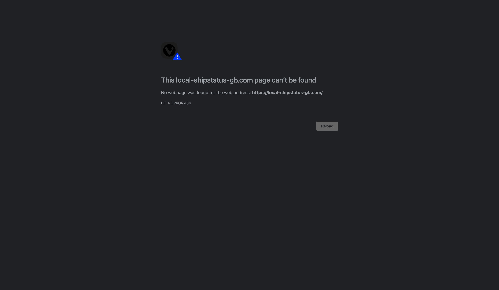

---
Below is the site:

Site looks like normal post office
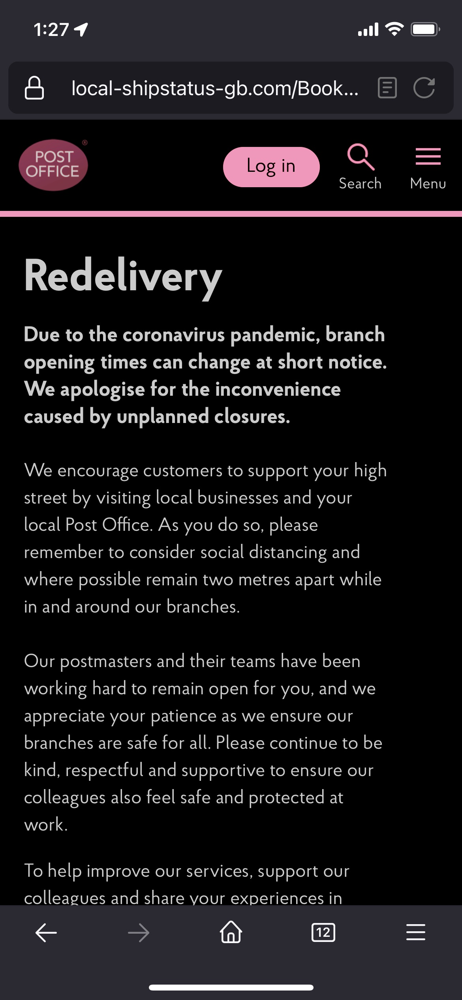

Once the page has loaded, it shows a popup
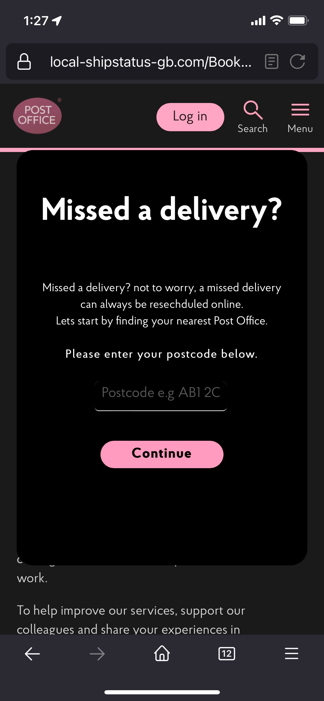
There is no validation on this, you can put `abc123` which is URL encoded and sent to the PHP

Next there is a fake branch finder, which shows a map
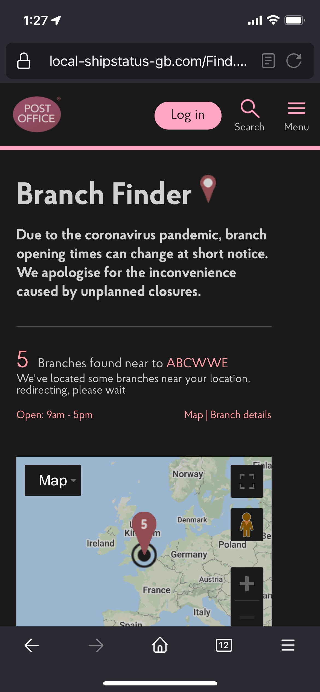

You are next asked for a Name, address and email address.
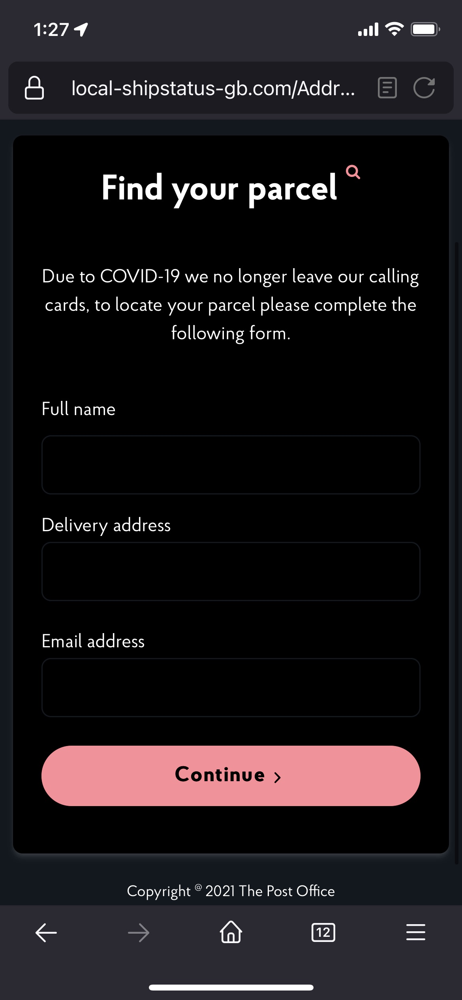
Only the email address has form validation on. You only need to supply `char(1)'@'char(1)` (one character either side of the @)

Next you are asked for Data of birth and a phone number
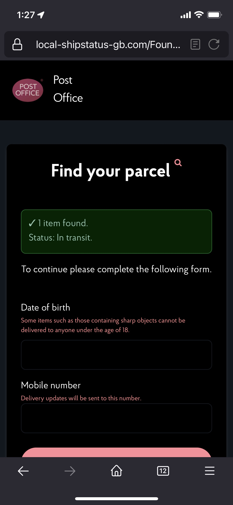

The DOB needs to be less than `2000` so this suggests their PHP is rather old!

The phone number also needs to be of a standard UK phone number length
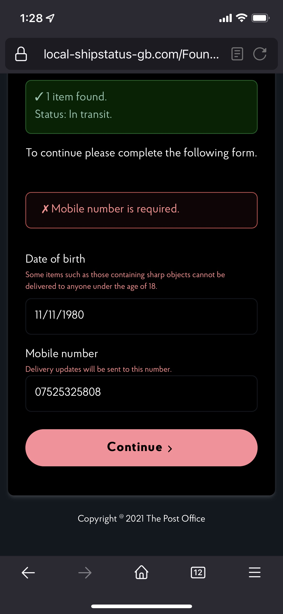

You are then asked for a Delivery date from a drop down. It seems to select the next weeks date.
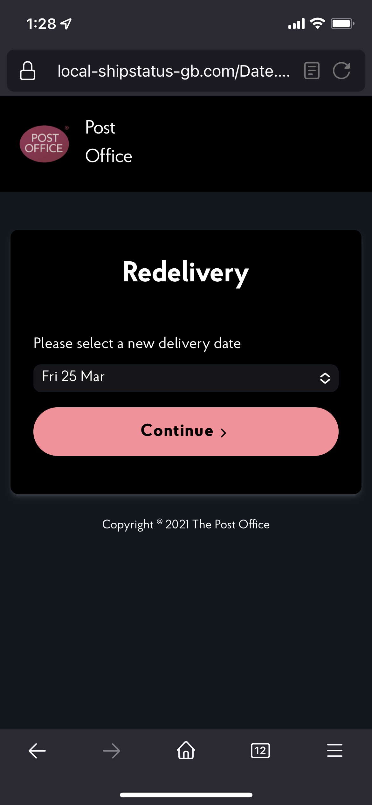

Next you are asked for Payment details
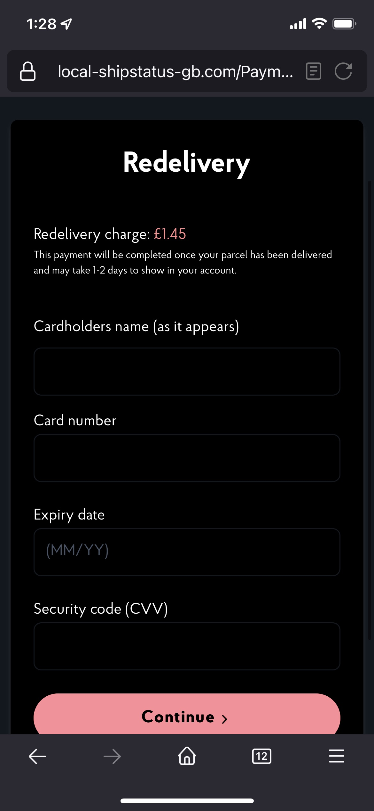

The only validation seems to be around the card numbers, so from what I can see, they must be validating the card as they insert it in to their database. 
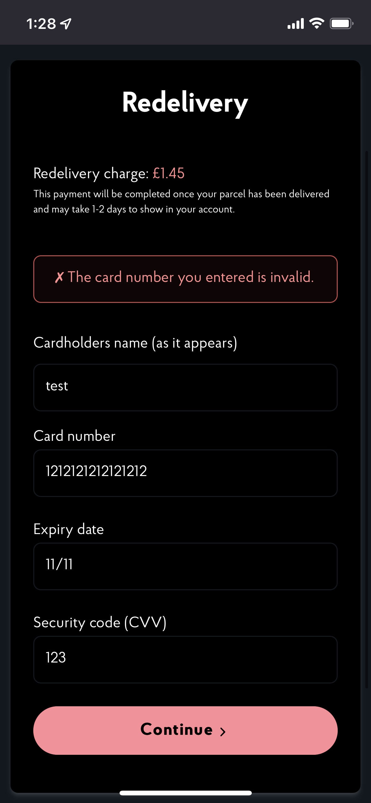

But when we supply it with a Test Visa number, this seems to work!
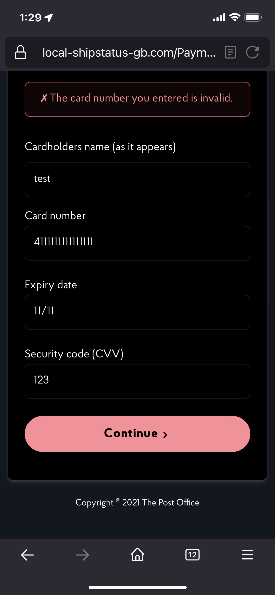

Finally the site accepts it, and presents an exit button
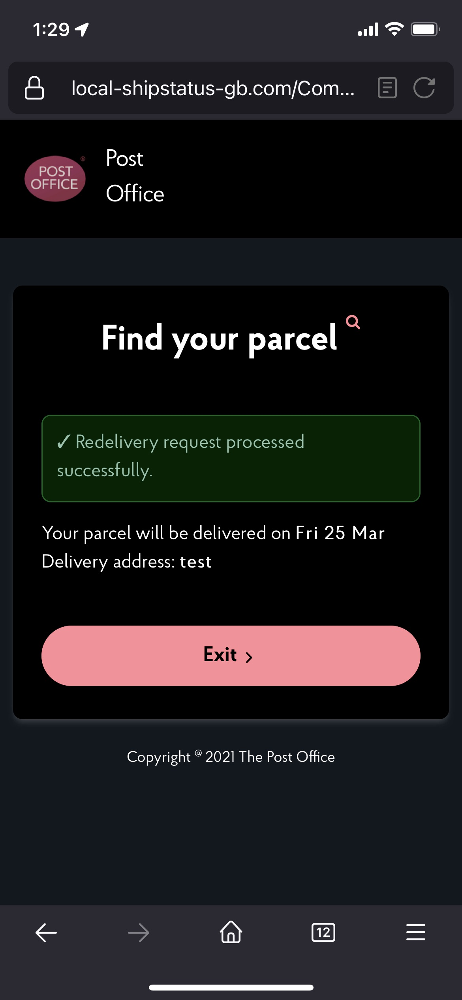

You are then redirected to the *real* post office site


---

# Their Infrastructure

From what I can see, they are using a Cpanel server hosted in Switzland on the IP address:

Cpanel IP: 179.43.184.58

Cpanel login: https://179-43-184-58.cprapid.com:2087

Main site: local-shipstatus-gb.com

CPContacts: https://cpcontacts.local-shipstatus-gb.com

Reverse proxy for main site: 31.7.56.41

Whois for main site:

```commandline
% IANA WHOIS server
% for more information on IANA, visit http://www.iana.org
% This query returned 1 object

refer:        whois.ripe.net

inetnum:      31.0.0.0 - 31.255.255.255
organisation: RIPE NCC
status:       ALLOCATED

whois:        whois.ripe.net

changed:      2010-05
source:       IANA

# whois.ripe.net

inetnum:        31.7.56.32 - 31.7.56.63
netname:        CYBERLOCKER
descr:          CYBER LOCKER SWITZERLAND S.A.
country:        CH
admin-c:        CS9490-RIPE
tech-c:         CS9490-RIPE
status:         ASSIGNED PA
mnt-by:         KP73900-MNT
created:        2012-10-22T19:43:48Z
last-modified:  2012-10-25T06:02:57Z
source:         RIPE

person:         CyberLocker Switzerland
address:        Swiss Post Box 100951 Z¸rcherstrasse 161 CH - 8010 Z¸rich Switzerland
phone:          +41 44-508-7052
nic-hdl:        CS9490-RIPE
mnt-by:         KP73900-MNT
created:        2012-07-07T08:47:06Z
last-modified:  2012-07-07T08:49:59Z
source:         RIPE # Filtered

% Information related to '31.7.56.0/21AS51852'

route:          31.7.56.0/21
descr:          Ripe Allocation
origin:         AS51852
mnt-by:         KP73900-MNT
created:        2012-04-25T13:14:40Z
last-modified:  2012-04-25T13:14:40Z
source:         RIPE

% This query was served by the RIPE Database Query Service version 1.102.2 (BLAARKOP)


```


Whois for cpanel IP:

```commandline
% IANA WHOIS server
% for more information on IANA, visit http://www.iana.org
% This query returned 1 object

refer:        whois.lacnic.net

inetnum:      179.0.0.0 - 179.255.255.255
organisation: LACNIC
status:       ALLOCATED

whois:        whois.lacnic.net

changed:      2011-02
source:       IANA

# whois.lacnic.net


% Joint Whois - whois.lacnic.net
%  This server accepts single ASN, IPv4 or IPv6 queries

% LACNIC resource: whois.lacnic.net


% Copyright LACNIC lacnic.net
%  The data below is provided for information purposes
%  and to assist persons in obtaining information about or
%  related to AS and IP numbers registrations
%  By submitting a whois query, you agree to use this data
%  only for lawful purposes.
%  2022-03-22 10:41:22 (-03 -03:00)

inetnum:     179.43.128.0/18
status:      allocated
aut-num:     N/A
owner:       PRIVATE LAYER INC
ownerid:     PA-PLIN-LACNIC
responsible: Milciades Garcia
address:     Torres De Las Americas, Torre C, 0, Suite 1404, Floor 14
address:     00000 - Panama - 
country:     PA
phone:       +41 43 5082295
owner-c:     MIG23
tech-c:      MIG23
abuse-c:     MIG23
inetrev:     179.43.128.0/24
nserver:     DNS01.PRIVATELAYER.COM
nsstat:      20220320 AA
nslastaa:    20220320
nserver:     DNS02.PRIVATELAYER.COM
nsstat:      20220320 AA
nslastaa:    20220320
inetrev:     179.43.129.0/24
nserver:     DNS01.PRIVATELAYER.COM
nsstat:      20220318 AA
nslastaa:    20220318
nserver:     DNS02.PRIVATELAYER.COM
nsstat:      20220318 AA
nslastaa:    20220318
inetrev:     179.43.130.0/24
nserver:     DNS01.PRIVATELAYER.COM
nsstat:      20220320 AA
nslastaa:    20220320
nserver:     DNS02.PRIVATELAYER.COM
nsstat:      20220320 AA
nslastaa:    20220320
inetrev:     179.43.131.0/24
nserver:     DNS01.PRIVATELAYER.COM
nsstat:      20220319 AA
nslastaa:    20220319
nserver:     DNS02.PRIVATELAYER.COM
nsstat:      20220319 AA
nslastaa:    20220319
inetrev:     179.43.132.0/24
nserver:     DNS01.PRIVATELAYER.COM
nsstat:      20220320 AA
nslastaa:    20220320
nserver:     DNS02.PRIVATELAYER.COM
nsstat:      20220320 AA
nslastaa:    20220320
inetrev:     179.43.133.0/24
nserver:     DNS01.PRIVATELAYER.COM
nsstat:      20220321 AA
nslastaa:    20220321
nserver:     DNS02.PRIVATELAYER.COM
nsstat:      20220321 AA
nslastaa:    20220321
inetrev:     179.43.134.0/24
nserver:     DNS01.PRIVATELAYER.COM
nsstat:      20220322 AA
nslastaa:    20220322
nserver:     DNS02.PRIVATELAYER.COM [lame - not published]
nsstat:      20220322 NOT SYNC ZONE
nslastaa:    20220303
inetrev:     179.43.140.0/24
nserver:     DNS01.PRIVATELAYER.COM
nsstat:      20220322 AA
nslastaa:    20220322
inetrev:     179.43.141.0/24
nserver:     DNS01.PRIVATELAYER.COM
nsstat:      20220322 AA
nslastaa:    20220322
nserver:     DNS02.PRIVATELAYER.COM [lame - not published]
nsstat:      20220322 NOT SYNC ZONE
nslastaa:    20220223
inetrev:     179.43.144.0/24
nserver:     DNS01.PRIVATELAYER.COM
nsstat:      20220320 AA
nslastaa:    20220320
nserver:     DNS02.PRIVATELAYER.COM
nsstat:      20220320 AA
nslastaa:    20220320
inetrev:     179.43.142.0/24
nserver:     DNS01.PRIVATELAYER.COM
nsstat:      20220321 AA
nslastaa:    20220321
nserver:     DNS02.PRIVATELAYER.COM
nsstat:      20220321 AA
nslastaa:    20220321
inetrev:     179.43.143.0/24
nserver:     DNS01.PRIVATELAYER.COM
nsstat:      20220322 AA
nslastaa:    20220322
nserver:     DNS02.PRIVATELAYER.COM [lame - not published]
nsstat:      20220322 NOT SYNC ZONE
nslastaa:    20220225
inetrev:     179.43.150.0/24
nserver:     DNS01.PRIVATELAYER.COM
nsstat:      20220321 AA
nslastaa:    20220321
nserver:     DNS02.PRIVATELAYER.COM
nsstat:      20220321 AA
nslastaa:    20220321
inetrev:     179.43.151.0/24
nserver:     DNS01.PRIVATELAYER.COM
nsstat:      20220319 AA
nslastaa:    20220319
nserver:     DNS02.PRIVATELAYER.COM
nsstat:      20220319 AA
nslastaa:    20220319
inetrev:     179.43.145.0/24
nserver:     DNS01.PRIVATELAYER.COM
nsstat:      20220322 AA
nslastaa:    20220322
nserver:     DNS02.PRIVATELAYER.COM
nsstat:      20220322 AA
nslastaa:    20220322
inetrev:     179.43.155.0/24
nserver:     DNS01.PRIVATELAYER.COM
nsstat:      20220320 AA
nslastaa:    20220320
nserver:     DNS02.PRIVATELAYER.COM
nsstat:      20220320 AA
nslastaa:    20220320
inetrev:     179.43.157.0/24
nserver:     DNS01.PRIVATELAYER.COM
nsstat:      20220320 AA
nslastaa:    20220320
nserver:     DNS02.PRIVATELAYER.COM [lame - not published]
nsstat:      20220320 UDN
nslastaa:    20220222
inetrev:     179.43.182.0/24
nserver:     NS1.CURTIR.ME [lame - not published]
nsstat:      20220320 UH
nslastaa:    20190327
nserver:     NS2.CURTIR.ME [lame - not published]
nsstat:      20220320 UH
nslastaa:    20190327
inetrev:     179.43.183.0/24
nserver:     DNS01.PRIVATELAYER.COM
nsstat:      20220319 AA
nslastaa:    20220319
nserver:     DNS02.PRIVATELAYER.COM
nsstat:      20220319 AA
nslastaa:    20220319
inetrev:     179.43.187.0/24
nserver:     DNS01.PRIVATELAYER.COM
nsstat:      20220321 AA
nslastaa:    20220321
nserver:     DNS02.PRIVATELAYER.COM
nsstat:      20220321 AA
nslastaa:    20220321
inetrev:     179.43.188.0/24
nserver:     DNS01.PRIVATELAYER.COM
nsstat:      20220320 AA
nslastaa:    20220320
nserver:     DNS02.PRIVATELAYER.COM
nsstat:      20220320 AA
nslastaa:    20220320
inetrev:     179.43.190.0/24
nserver:     DNS01.PRIVATELAYER.COM
nsstat:      20220319 AA
nslastaa:    20220319
nserver:     DNS02.PRIVATELAYER.COM
nsstat:      20220319 AA
nslastaa:    20220319
inetrev:     179.43.191.0/24
nserver:     DNS01.PRIVATELAYER.COM
nsstat:      20220321 AA
nslastaa:    20220321
nserver:     DNS02.PRIVATELAYER.COM
nsstat:      20220321 AA
nslastaa:    20220321
inetrev:     179.43.161.0/24
nserver:     DNS01.PRIVATELAYER.COM
nsstat:      20220322 AA
nslastaa:    20220322
nserver:     DNS02.PRIVATELAYER.COM [lame - not published]
nsstat:      20220322 UDN
nslastaa:    20220225
inetrev:     179.43.146.0/24
nserver:     DNS01.PRIVATELAYER.COM
nsstat:      20220321 AA
nslastaa:    20220321
nserver:     DNS02.PRIVATELAYER.COM
nsstat:      20220321 AA
nslastaa:    20220321
inetrev:     179.43.160.0/24
nserver:     DNS01.PRIVATELAYER.COM
nsstat:      20220322 AA
nslastaa:    20220322
nserver:     DNS02.PRIVATELAYER.COM
nsstat:      20220322 AA
nslastaa:    20220322
inetrev:     179.43.148.0/24
nserver:     DNS01.PRIVATELAYER.COM
nsstat:      20220322 AA
nslastaa:    20220322
nserver:     DNS02.PRIVATELAYER.COM [lame - not published]
nsstat:      20220322 NOT SYNC ZONE
nslastaa:    20220225
inetrev:     179.43.152.0/24
nserver:     DNS01.PRIVATELAYER.COM
nsstat:      20220322 AA
nslastaa:    20220322
nserver:     DNS02.PRIVATELAYER.COM
nsstat:      20220322 AA
nslastaa:    20220322
inetrev:     179.43.162.0/24
nserver:     DNS01.PRIVATELAYER.COM
nsstat:      20220318 AA
nslastaa:    20220318
nserver:     DNS02.PRIVATELAYER.COM
nsstat:      20220318 AA
nslastaa:    20220318
inetrev:     179.43.169.0/24
nserver:     DNS01.PRIVATELAYER.COM
nsstat:      20220318 AA
nslastaa:    20220318
nserver:     DNS02.PRIVATELAYER.COM
nsstat:      20220318 AA
nslastaa:    20220318
inetrev:     179.43.178.0/24
nserver:     DNS01.PRIVATELAYER.COM
nsstat:      20220318 AA
nslastaa:    20220318
nserver:     DNS02.PRIVATELAYER.COM
nsstat:      20220318 AA
nslastaa:    20220318
inetrev:     179.43.139.0/24
nserver:     DNS01.PRIVATELAYER.COM
nsstat:      20220321 AA
nslastaa:    20220321
nserver:     DNS02.PRIVATELAYER.COM
nsstat:      20220321 AA
nslastaa:    20220321
inetrev:     179.43.163.0/24
nserver:     DNS01.PRIVATELAYER.COM
nsstat:      20220319 AA
nslastaa:    20220319
nserver:     DNS02.PRIVATELAYER.COM
nsstat:      20220319 AA
nslastaa:    20220319
inetrev:     179.43.165.0/24
nserver:     DNS01.PRIVATELAYER.COM
nsstat:      20220319 AA
nslastaa:    20220319
nserver:     DNS02.PRIVATELAYER.COM
nsstat:      20220319 AA
nslastaa:    20220319
inetrev:     179.43.166.0/24
nserver:     NS-160.AWSDNS-20.COM [lame - not published]
nsstat:      20220320 QREFUSED
nslastaa:    20150425
nserver:     NS-1647.AWSDNS-13.CO.UK [lame - not published]
nsstat:      20220320 QREFUSED
nslastaa:    20150425
inetrev:     179.43.167.0/24
nserver:     DNS01.PRIVATELAYER.COM
nsstat:      20220322 AA
nslastaa:    20220322
nserver:     DNS02.PRIVATELAYER.COM
nsstat:      20220322 AA
nslastaa:    20220322
inetrev:     179.43.168.0/24
nserver:     DNS01.PRIVATELAYER.COM
nsstat:      20220320 AA
nslastaa:    20220320
nserver:     DNS02.PRIVATELAYER.COM
nsstat:      20220320 AA
nslastaa:    20220320
inetrev:     179.43.176.0/24
nserver:     DNS01.PRIVATELAYER.COM
nsstat:      20220320 AA
nslastaa:    20220320
inetrev:     179.43.149.0/24
nserver:     DNS01.PRIVATELAYER.COM
nsstat:      20220322 AA
nslastaa:    20220322
nserver:     DNS02.PRIVATELAYER.COM [lame - not published]
nsstat:      20220322 NOT SYNC ZONE
nslastaa:    20220224
inetrev:     179.43.181.0/24
nserver:     NS1.LEADSPLANOSDESAUDE.COM.BR [lame - not published]
nsstat:      20220322 UH
nslastaa:    20150727
nserver:     NS2.LEADSPLANOSDESAUDE.COM.BR [lame - not published]
nsstat:      20220322 UH
nslastaa:    20150727
inetrev:     179.43.154.0/24
nserver:     DNS01.PRIVATELAYER.COM
nsstat:      20220321 AA
nslastaa:    20220321
nserver:     DNS02.PRIVATELAYER.COM
nsstat:      20220321 AA
nslastaa:    20220321
inetrev:     179.43.184.0/24
nserver:     DNS01.PRIVATELAYER.COM
nsstat:      20220322 AA
nslastaa:    20220322
nserver:     DNS02.PRIVATELAYER.COM
nsstat:      20220322 AA
nslastaa:    20220322
inetrev:     179.43.185.0/24
nserver:     DNS01.PRIVATELAYER.COM
nsstat:      20220320 AA
nslastaa:    20220320
nserver:     DNS02.PRIVATELAYER.COM
nsstat:      20220320 AA
nslastaa:    20220320
inetrev:     179.43.186.0/24
nserver:     DNS01.PRIVATELAYER.COM
nsstat:      20220321 AA
nslastaa:    20220321
nserver:     DNS02.PRIVATELAYER.COM
nsstat:      20220321 AA
nslastaa:    20220321
inetrev:     179.43.172.0/24
nserver:     DNS01.PRIVATELAYER.COM
nsstat:      20220320 AA
nslastaa:    20220320
nserver:     DNS02.PRIVATELAYER.COM
nsstat:      20220320 AA
nslastaa:    20220320
inetrev:     179.43.170.0/24
nserver:     DNS01.PRIVATELAYER.COM
nsstat:      20220317 AA
nslastaa:    20220317
nserver:     DNS02.PRIVATELAYER.COM
nsstat:      20220317 AA
nslastaa:    20220317
inetrev:     179.43.156.0/24
nserver:     DNS01.PRIVATELAYER.COM
nsstat:      20220322 AA
nslastaa:    20220322
nserver:     DNS02.PRIVATELAYER.COM [lame - not published]
nsstat:      20220322 NOT SYNC ZONE
nslastaa:    20220223
inetrev:     179.43.189.0/24
nserver:     DNS01.PRIVATELAYER.COM
nsstat:      20220320 AA
nslastaa:    20220320
nserver:     DNS02.PRIVATELAYER.COM
nsstat:      20220320 AA
nslastaa:    20220320
inetrev:     179.43.164.0/24
nserver:     NS-437.AWSDNS-54.COM [lame - not published]
nsstat:      20220322 QREFUSED
nslastaa:    20150424
nserver:     NS-1214.AWSDNS-23.ORG [lame - not published]
nsstat:      20220322 QREFUSED
nslastaa:    20150424
inetrev:     179.43.171.0/24
nserver:     DNS01.PRIVATELAYER.COM
nsstat:      20220319 AA
nslastaa:    20220319
nserver:     DNS02.PRIVATELAYER.COM
nsstat:      20220319 AA
nslastaa:    20220319
inetrev:     179.43.177.0/24
nserver:     DNS01.PRIVATELAYER.COM
nsstat:      20220320 AA
nslastaa:    20220320
nserver:     DNS02.PRIVATELAYER.COM
nsstat:      20220320 AA
nslastaa:    20220320
inetrev:     179.43.180.0/24
nserver:     DNS01.PRIVATELAYER.COM
nsstat:      20220319 AA
nslastaa:    20220319
nserver:     DNS02.PRIVATELAYER.COM
nsstat:      20220319 AA
nslastaa:    20220319
inetrev:     179.43.158.0/24
nserver:     DNS01.PRIVATELAYER.COM
nsstat:      20220321 AA
nslastaa:    20220321
nserver:     DNS02.PRIVATELAYER.COM
nsstat:      20220321 AA
nslastaa:    20220321
inetrev:     179.43.159.0/24
nserver:     DNS01.PRIVATELAYER.COM
nsstat:      20220320 AA
nslastaa:    20220320
nserver:     DNS02.PRIVATELAYER.COM
nsstat:      20220320 AA
nslastaa:    20220320
inetrev:     179.43.147.0/24
nserver:     DNS01.PRIVATELAYER.COM
nsstat:      20220320 AA
nslastaa:    20220320
nserver:     DNS02.PRIVATELAYER.COM
nsstat:      20220320 AA
nslastaa:    20220320
inetrev:     179.43.173.0/24
nserver:     DNS01.PRIVATELAYER.COM
nsstat:      20220321 AA
nslastaa:    20220321
nserver:     DNS02.PRIVATELAYER.COM
nsstat:      20220321 AA
nslastaa:    20220321
inetrev:     179.43.174.0/24
nserver:     DNS01.PRIVATELAYER.COM
nsstat:      20220320 AA
nslastaa:    20220320
nserver:     DNS02.PRIVATELAYER.COM [lame - not published]
nsstat:      20220320 UDN
nslastaa:    20220222
inetrev:     179.43.175.0/24
nserver:     DNS01.PRIVATELAYER.COM
nsstat:      20220321 AA
nslastaa:    20220321
nserver:     DNS02.PRIVATELAYER.COM
nsstat:      20220321 AA
nslastaa:    20220321
inetrev:     179.43.179.0/24
nserver:     DNS01.PRIVATELAYER.COM
nsstat:      20220321 AA
nslastaa:    20220321
nserver:     DNS02.PRIVATELAYER.COM
nsstat:      20220321 AA
nslastaa:    20220321
created:     20131112
changed:     20151101

nic-hdl:     MIG23
person:      Milciades Garcia
e-mail:      support@privatelayer.com
address:     Edif. Ocean Business Plaza, 1404, Marbella
address:     00000 - Panama City - 
country:     PA
phone:       +41 43 5082295
created:     20151023
changed:     20220206

% whois.lacnic.net accepts only direct match queries.
% Types of queries are: POCs, ownerid, CIDR blocks, IP
% and AS numbers.


```

Certificates for their Domain

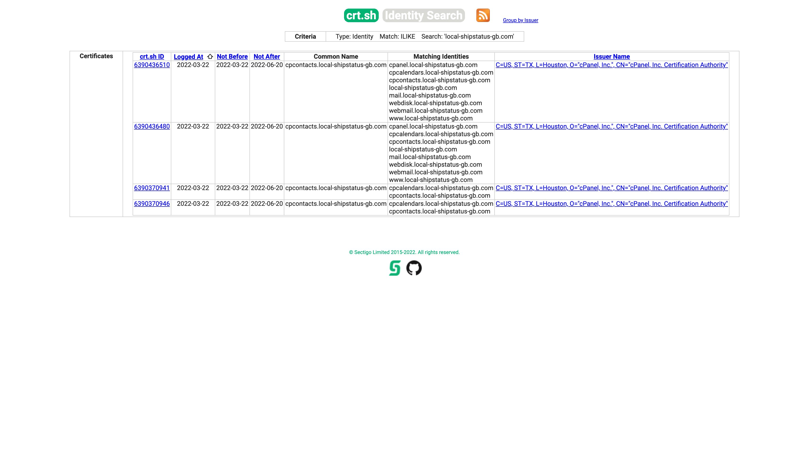

Domains they have:

```commandline
cpanel.local-shipstatus-gb.com
cpcalendars.local-shipstatus-gb.com
cpcontacts.local-shipstatus-gb.com
local-shipstatus-gb.com
mail.local-shipstatus-gb.com
webdisk.local-shipstatus-gb.com
webmail.local-shipstatus-gb.com
www.local-shipstatus-gb.com
```

Shodan for Cpanel server:

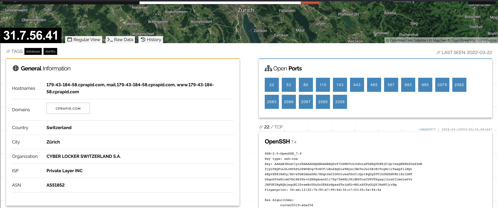

Exploits Shodan has recorded:

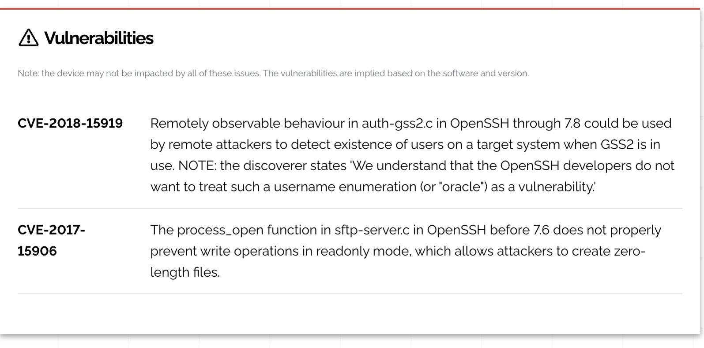

